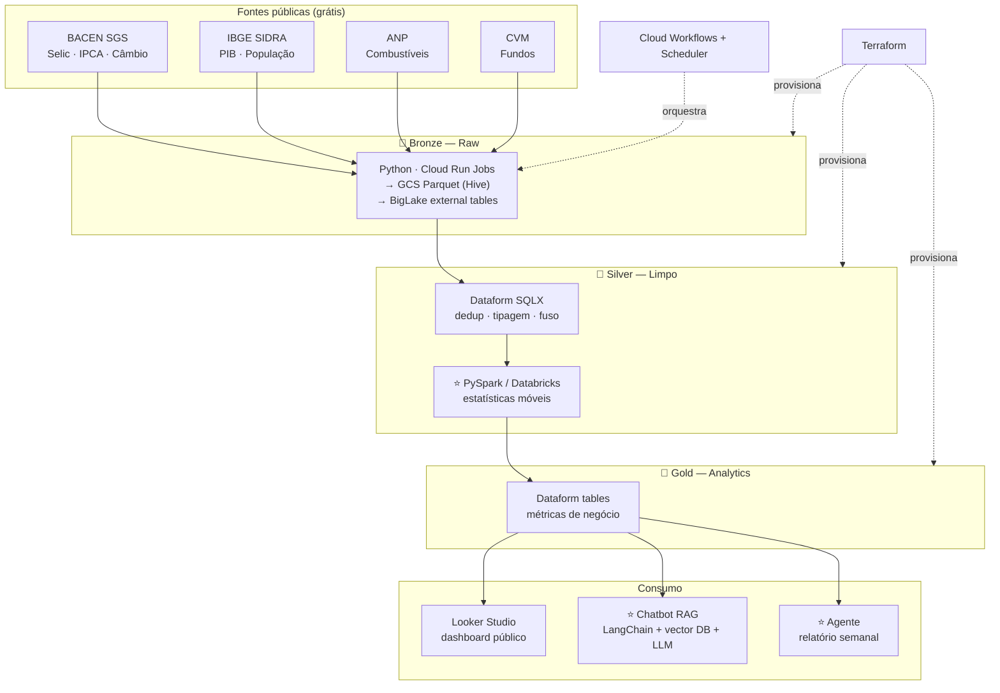

# Panorama BR — Lakehouse Open-Data com camada de IA


Lakehouse **multi-fonte** de dados públicos brasileiros (macroeconomia, câmbio, combustíveis, fundos)
seguindo arquitetura **Medallion (Bronze → Silver → Gold)** no Google Cloud, com **transformação em
PySpark**, orquestração serverless, IaC completo, CI/CD e uma **camada de IA Generativa** que responde
perguntas em linguagem natural sobre os dados e gera relatórios macroeconômicos automáticos.

> Projeto de portfólio — 100% dados públicos e código aberto. Constrói, do zero, um pipeline de dados
> de nível produção **e** uma aplicação de GenAI/RAG sobre o resultado.

---

## Arquitetura



⭐ = o que vai **além** de um lakehouse tradicional (Spark + camada de GenAI).

---

## Camadas (Medallion)

| Camada | O que faz | Tecnologia | Materialização |
|--------|-----------|-----------|----------------|
| **Bronze** | Extração crua das APIs | Python em Cloud Run Jobs → GCS Parquet (Hive `year/month/day`) → BigLake | Parquet externo |
| **Silver** | Limpeza, dedup, tipagem, fuso + estatísticas em PySpark | Dataform SQLX (incremental) + Databricks/Dataproc | Tabela nativa BigQuery |
| **Gold** | Métricas de negócio, joins entre domínios | Dataform (`type: "table"`) | Tabela nativa BigQuery |
| **IA** | Chatbot RAG (NL→SQL) + agente de relatório | LangChain + vector DB + LLM | App Python |

---

## Stack (tudo free tier / gratuito)

| Camada | Ferramenta |
|--------|-----------|
| Warehouse | BigQuery (sandbox) |
| Transformação | Dataform |
| Spark | Databricks Community Edition / Dataproc Serverless |
| Ingestão | Cloud Run Jobs |
| Orquestração | Cloud Workflows + Scheduler |
| IaC | Terraform |
| CI/CD | GitHub Actions |
| GenAI | LangChain + Chroma/FAISS + LLM (Gemini/Claude) |
| Dashboard | Looker Studio |

---

## Fontes de dados

| Fonte | Dado | Auth | Doc |
|-------|------|------|-----|
| **Banco Central (SGS)** | Selic, IPCA, câmbio USD/BRL | Nenhuma | `https://dadosabertos.bcb.gov.br/` |
| **IBGE (SIDRA)** | PIB, população, inflação | Nenhuma | `https://apisidra.ibge.gov.br/` |
| **ANP** | Preços de combustíveis | Nenhuma (CSV) | dados abertos ANP |
| **CVM** | Fundos de investimento | Nenhuma (CSV) | dados abertos CVM |

---

## Estrutura do projeto

```
panorama-br/
├── jobs/bronze/            # Extratores Python (1 por fonte)
├── definitions/            # Dataform: sources.js + silver/ + gold/
├── spark/                  # Jobs PySpark (Silver pesado)
├── genai/                  # Chatbot RAG + agente de relatório
├── terraform/              # Infraestrutura (IaC)
├── workflows/              # Cloud Workflows (orquestração)
├── docs/                   # Arquitetura e decisões
└── .github/workflows/      # CI/CD
```

---

## Roadmap

- [x] **Fase 0** — Scaffold: estrutura, README, arquitetura, base Terraform
- [x] **Fase 1** — Bronze: extratores BACEN SGS + IBGE (fail-loud) validados contra APIs reais + tabelas BigLake no Terraform · _deploy pendente de projeto GCP_
- [x] **Fase 2** — Silver: Dataform (SGS + SIDRA) + job PySpark de estatísticas móveis (lógica validada com dados reais) · _execução no Databricks/Dataproc pendente de projeto GCP_
- [x] **Fase 3** — Gold: `indicadores_mensais` (IPCA 12m validado contra a série oficial BACEN 13522, diff ≤ 0,005 p.p.) + `populacao_brasil` + spec do dashboard · _publicação no Looker pendente de projeto GCP_
- [x] **Fase 4** — GenAI (Gemini): chatbot RAG NL→SQL com guarda-corpos + agente de relatório semanal — testados ao vivo ([exemplo de relatório gerado](docs/relatorios/2026-07-16.md))
- [ ] **Fase 5** — CI/CD + orquestração + polish

---

## Setup local

```bash
# 1. BigQuery sandbox (grátis, sem cartão): https://console.cloud.google.com/bigquery
#    Criar um projeto GCP e anotar o PROJECT_ID.

# 2. Dependências Python
pip install -r requirements.txt

# 3. Lint
ruff check . && ruff format .

# 4. Dataform (valida SQLX offline)
npx @dataform/cli compile

# 5. Terraform
terraform -chdir=terraform init
terraform -chdir=terraform plan
```

---

## Licença

MIT — veja [LICENSE](LICENSE).
