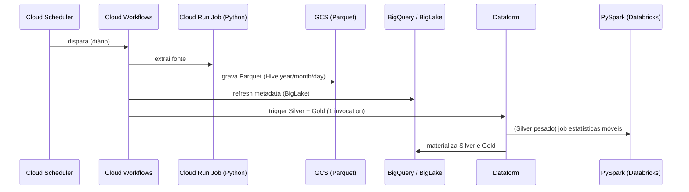

# Arquitetura — Panorama BR

## Princípios (herdados de boas práticas de lakehouse de produção)

1. **Medallion**: Bronze (raw) → Silver (limpo/tipado) → Gold (métricas). Nunca pular camadas.
2. **Bronze é imutável e fail-loud**: se a API falhar após retries, o job faz `sys.exit(1)`
   (dispara alerta). Nunca tratar falha de API como "sem dados".
3. **Silver incremental**: dedup por `QUALIFY ROW_NUMBER()`, tipagem forte com `SAFE_CAST`,
   filtro incremental por partição (`year/month/day`) para evitar full scan.
4. **Gold é `table`, nunca `view`**: consumo por Looker Studio (DirectQuery) — custo fixo no
   pipeline em vez de recalcular a cada carga do dashboard.
5. **Tudo em IaC**: nenhum recurso criado clicando no console; Terraform é a fonte da verdade.
6. **CI/CD**: compile + dry-run do Dataform, lint (ruff) e `terraform plan` a cada push.

## Fluxo de dados

## Camadas por domínio

| Domínio | Bronze | Silver | Gold |
|---------|--------|--------|------|
| Macro (BACEN) | `bacen_sgs` | `sgs_series` | `indicadores_mensais` |
| Demografia (IBGE) | `ibge_sidra` | `sidra_agregados` | `pib_populacao` |
| Combustíveis (ANP) | `anp_precos` | `precos_combustivel` | `precos_regiao` |
| Fundos (CVM) | `cvm_fundos` | `fundos` | `rentabilidade_fundos` |

> Fase 1 entrega BACEN + IBGE. ANP e CVM entram depois.

## Decisões em aberto

- [ ] PySpark rodando em Databricks Community vs Dataproc Serverless (custo × integração)
- [ ] LLM da camada GenAI: Gemini (free tier) vs Claude (melhor NL→SQL)
- [ ] Vector DB: Chroma (local, simples) vs FAISS
